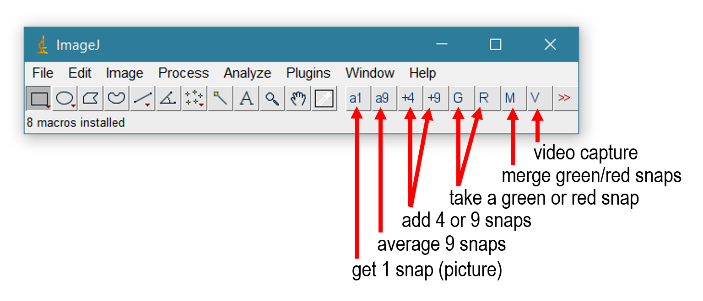

# Micro-Manager Plugins 

[µ-Manager](https://micro-manager.org/) (ImageJ) plugins for image/video acquisition in an electrophysiology environment

_This folder has absorbed https://github.com/swharden/micro-manager-plugins_

## Screenshot
_This can get quickly outdated, but you get the idea..._


## Setup
Edit your `StartupMacros.txt` file (which lives in Program Files / Micro Manager / macros) and add a line so `SWHLab.ijm` is executed at startup. It is ideal to have it executed after the micro-manager studio runs (which connects to the camera).

```javascript
macro "AutoRun" {
  run("Micro-Manager Studio");
  run("Install...", "install=[C:\\path\\to\\SWHLab.ijm]");
}
```

## Links
* https://micro-manager.org/
* [ImageJ macro language](https://imagej.nih.gov/ij/developer/macro/macros.html)
* [ImageJ built-in functions](https://imagej.nih.gov/ij/developer/macro/functions.html)

## Demo: timestamping (and drug-stamping) TIFs
I saved micrographs as a TIF then converted them to a BMP image sequence and used AVIDemux to make it an MP4 suitable for YouTube
* https://www.youtube.com/watch?v=1OHvPi1TbII
