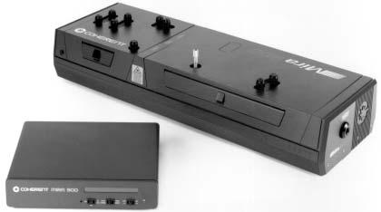
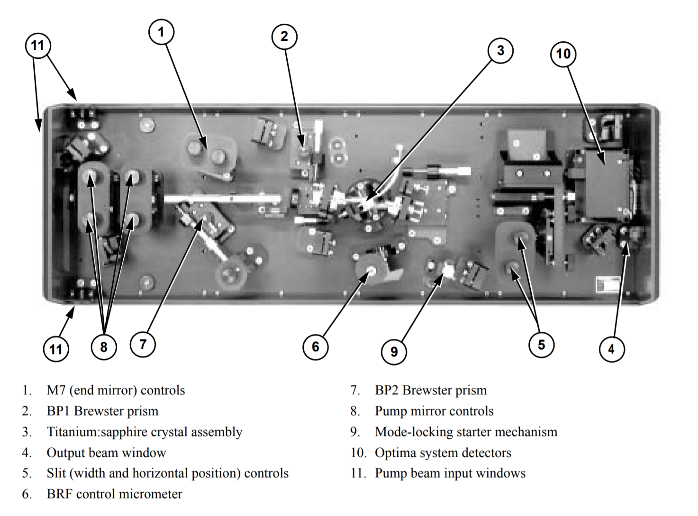
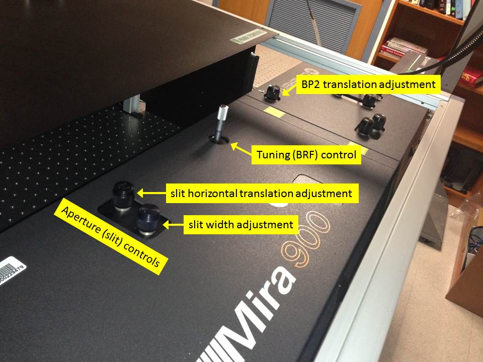
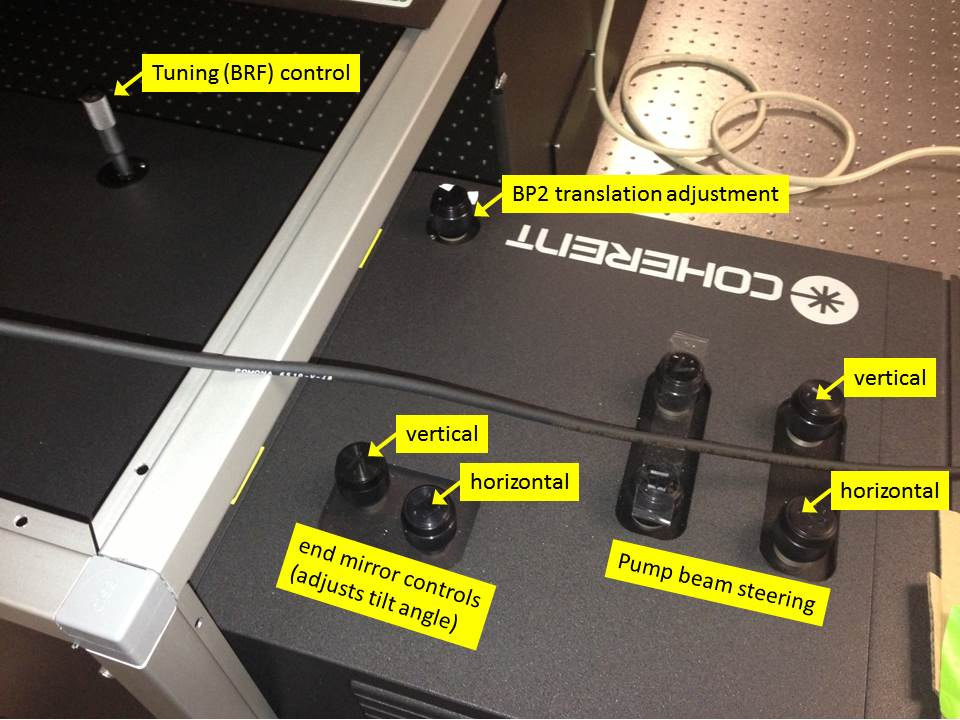
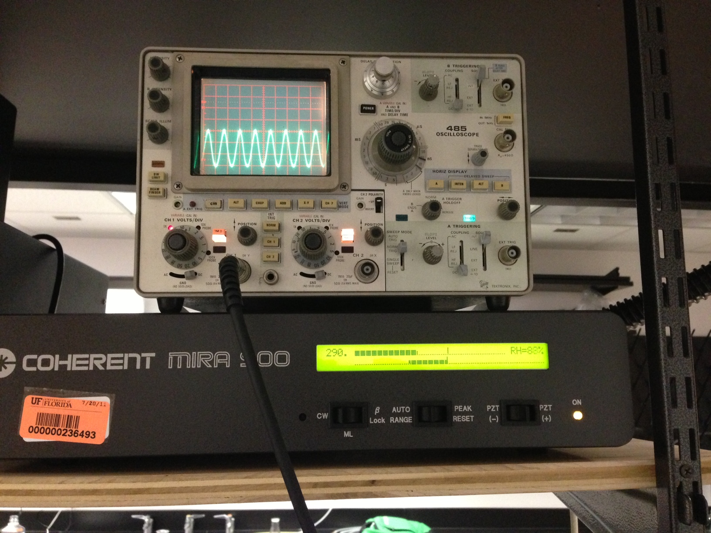
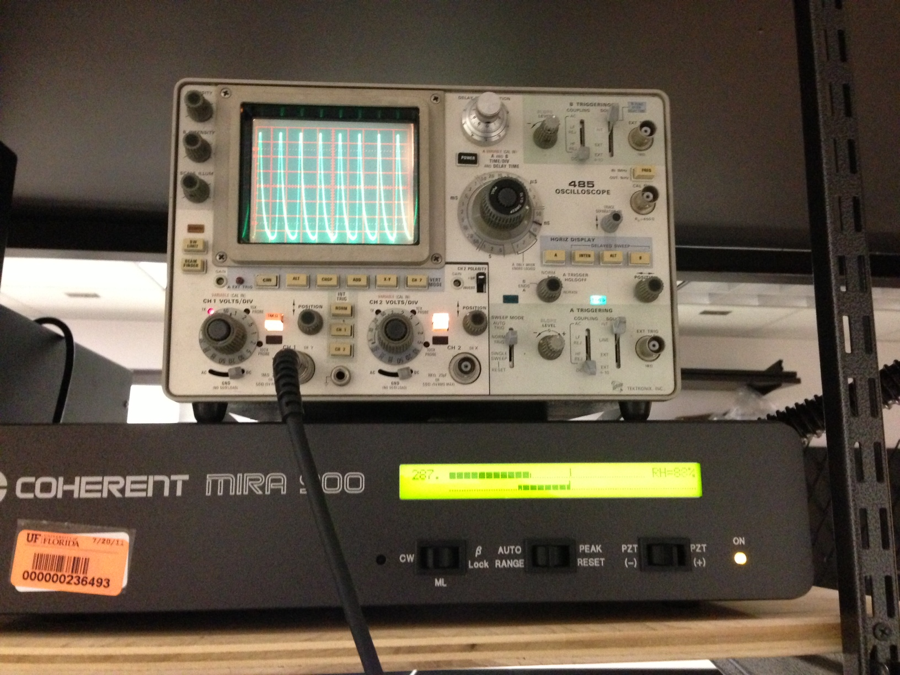
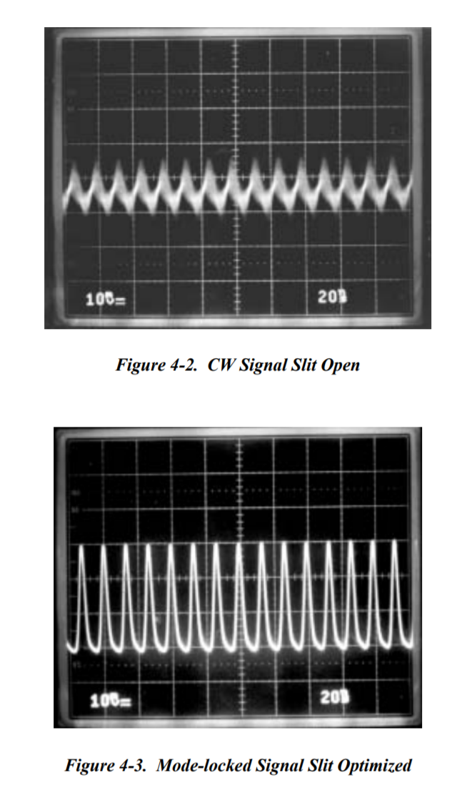
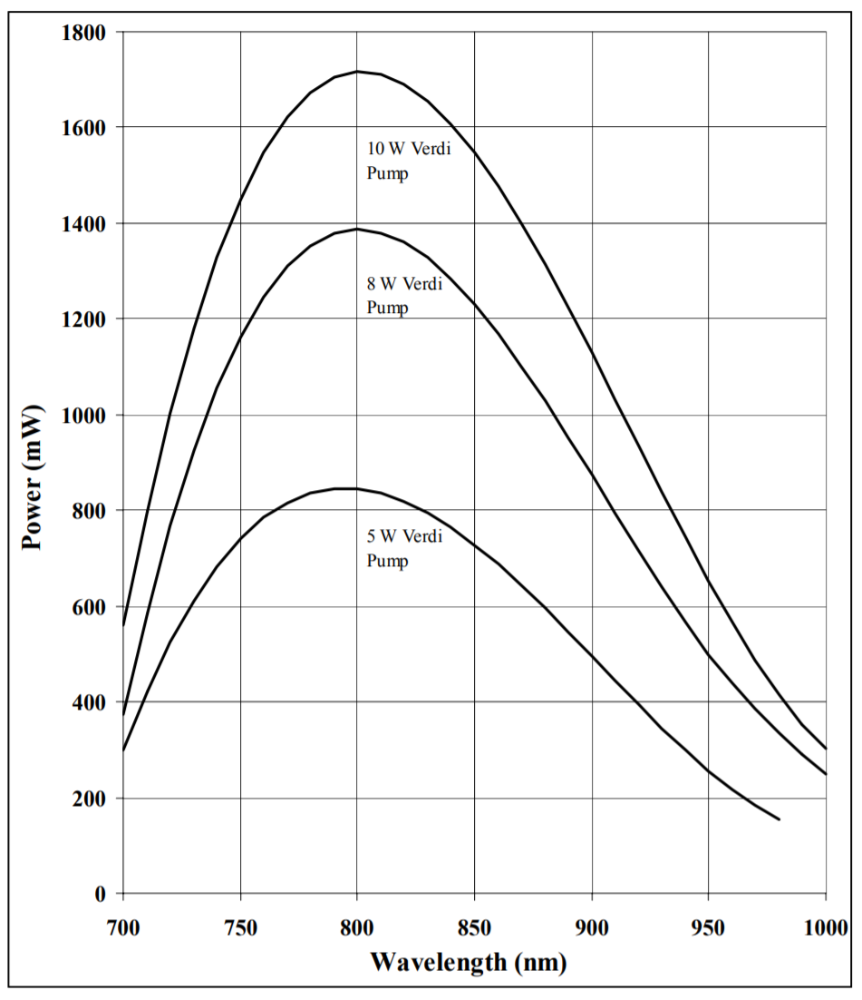
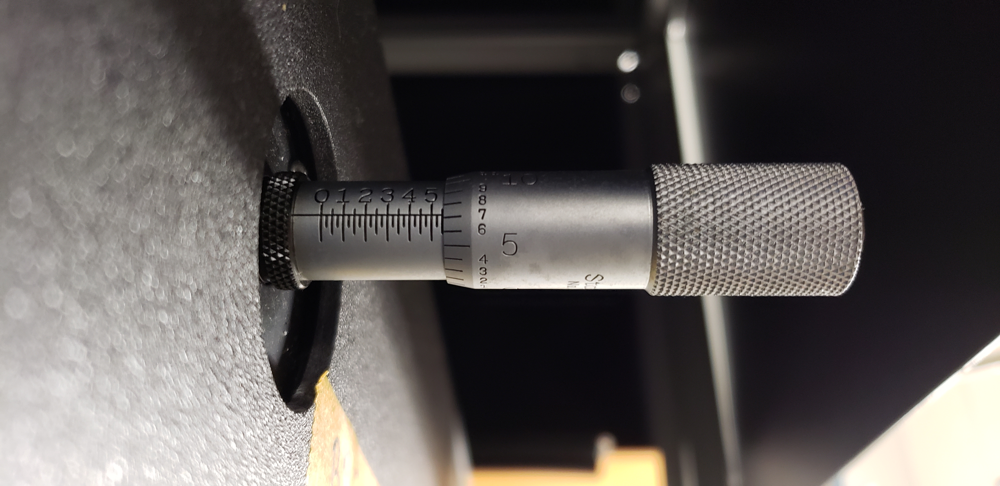

# Coherent Laser System

[Coherent Mira Optima 900-F](https://loci.wisc.edu/sites/default/files/2016-09/Mira%20Optima%20900-F%20Laser%20Operator%27s%20Manual%20%281%29.pdf) Operator's Manual (only 232 pages)

## Improving Mode Lock
_If you're reading this, you're probably having a bad day._

When it becomes difficult to mode-lock the laser (often predicted by a small or unclean sine wave), the laser may need to be realigned. Note that the [Coherent Mira Optima 900-F Laser Manual](https://loci.wisc.edu/sites/default/files/2016-09/Mira%20Optima%20900-F%20Laser%20Operator%27s%20Manual%20%281%29.pdf) is online. It is uncomfortably thorough. This really, really needs to be read and properly documented. For now, the following instructions are from tradition. Also, we could really use a concise description of how this laser works, and what all these knobs actually do.

* **Power-on the laser** as described in the start-up sequence. Do not mode-lock the laser.
  * Familiarize yourself with all of the knobs (their labels and positions)
  * Note the continuous wave (CW) and mode lock (ML) positions of the far left switch, as well as the range/reset switch
* **Maximally open the aperture (slit)** by rotating the width adjustment knob clockwise until maximum power is observed (as shown by the number on the far left of the display under the oscilloscope). This is often near 400. "Auto Range" or "Range Reset" may need to be toggled to optimally view power during this adjustment.
* **Close the aperture (slit)** to achieve 50% power by rotating the same knob you just adjusted counter-clockwise until the number on the display is half of maximum. This is often around 200.
* **Adjust aperture translation for maximum power** by rotating the slit horizontal translation adjustment knob in either direction to achieve maximum intensity as measured on the device below the oscilloscope.
* **Adjust the beam pump position** by rotating the pump beam steering knobs (just the right two) for maximum intensity.
* **Set the end mirror tilt angle** by rotating the end mirror controls to maximize power output.
* **Assess the purity of the sine wave.** If it is pure, it will mode-lock easily. If not, go back to the aperture adjustment step. This may need to be done a few times.

**Additional notes:** I have found that I get better results if, once mode locked, I slowly decrease laser intensity (by adjusting the iris) back down to 200. As I do this, I often lose mode lock, so I re-establish mode lock, twiddle ALL the knobs to maximize the intensity of the mode-locked peak, then slowly narrow the iris again. After doing this 6-8 times, the laser will mode lock really easily (even though the original sine wave looks surprisingly small, and of the wrong frequency), and the mode-locked laser power will be a steady 200.

## Photos and Diagrams

### Adjustments: 
 

### Left side:

### Right side:

### Not Locked:
 

### Mode Locked:

### Suggested Waveform:

### Ideal output spectrum and power:

### Micrometer Wavelength Adjustment
On 2018-10-19 the micrometer was adjsuted to tune the laser to 810nm. This is the reading at optimal tuning position.

