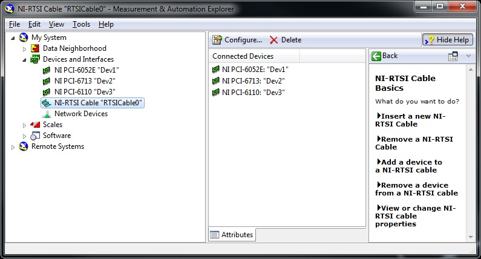

# NT-rtsi Setup

## Fixing nt-rtsi errors

Sometimes a Windows update will mess-up the NI device list. If PV won't scan and has a "ni-rtsi" error, do this:

* open the "ni max" program ("NI-RTSI cable")
* open "devices and interfaces"
* right-click each device and delete any device that can be deleted
* ensure the cable is deleted too
* right-click to rename the 3 NI devices as follows:
  * NI PCI-6052E: "Dev1"
  * NI PCI-6713: "Dev2"
  * NI PCI-6110: "Dev3"
* right-click "devices and interfaces" and select "create new"
* add a "NI-RTSI Cable"
* right-cliick the newly made cable and add a device
* add each of the 3 devices
* ensure your configuration is identical to that shown here

