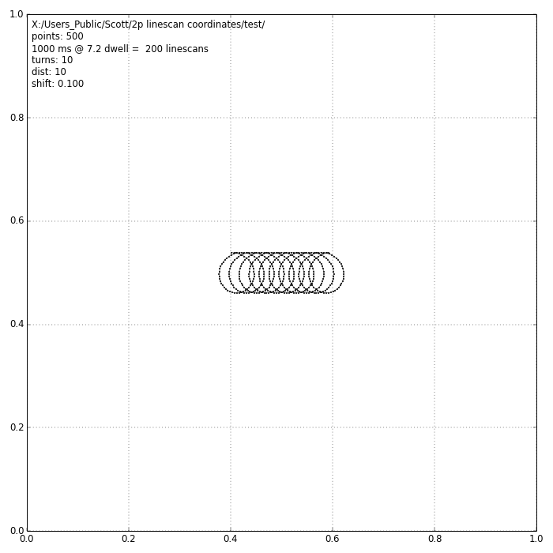
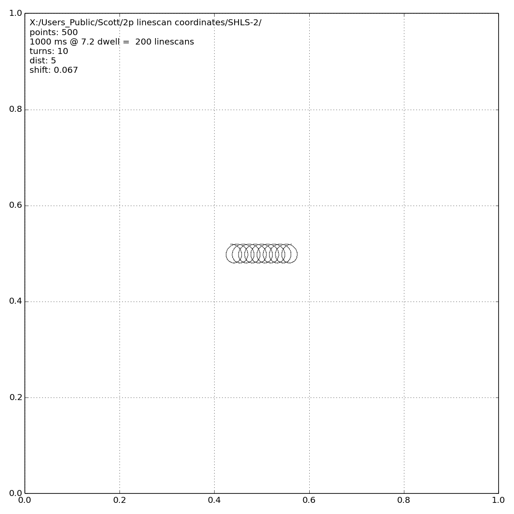
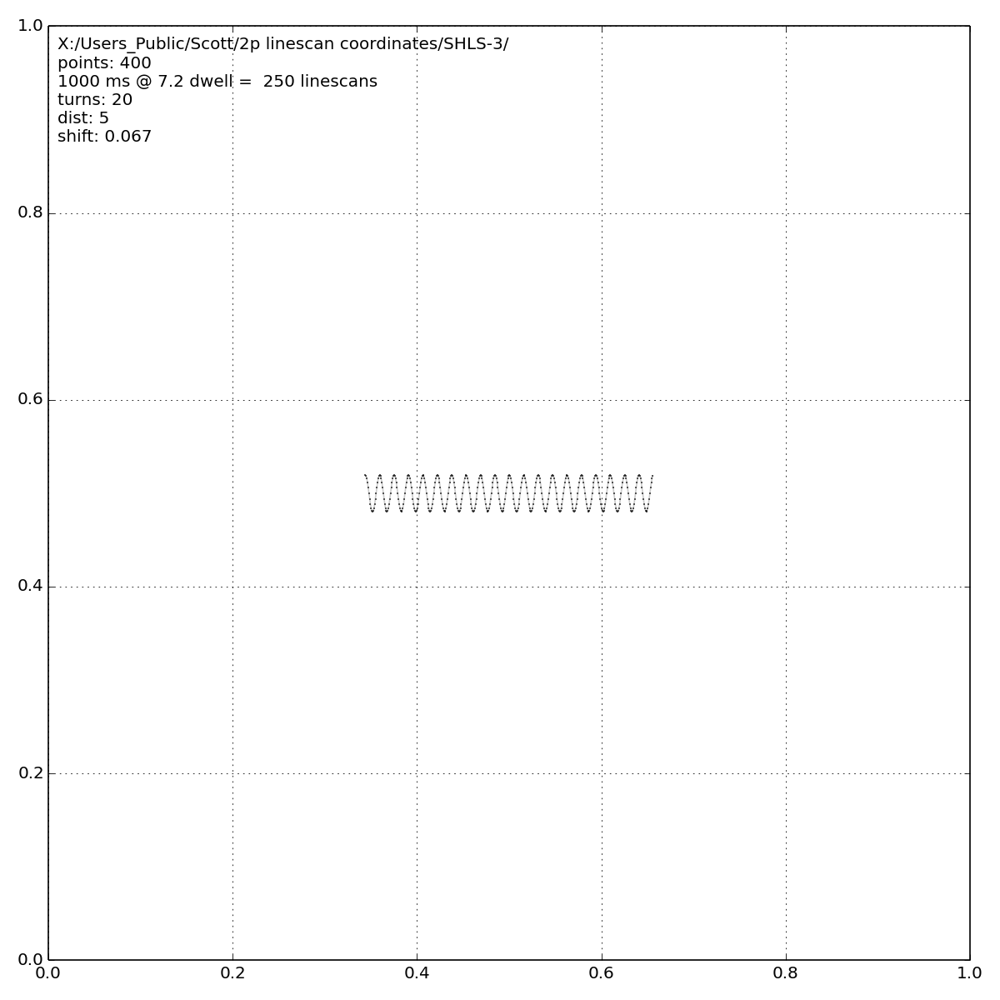

# Custom LineScans
At the time this script was written, PrairieView could not generate spiral linescans. These were generated with Python and are useful alternatives to straight linescans.

[large spiral](coords1.xml) | [small spiral](coords2.xml) | [cosine](coords3.xml) 
---|---|---
 |  | 
