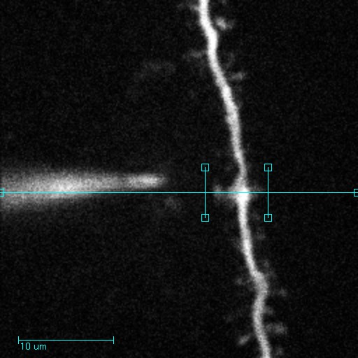
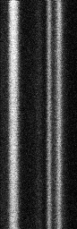
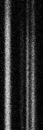
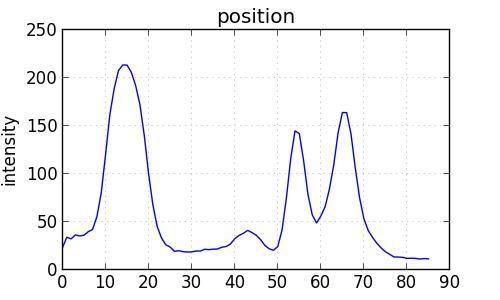
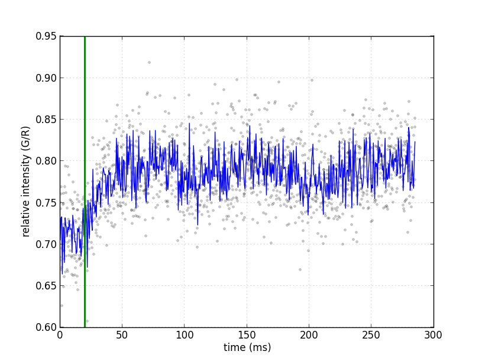
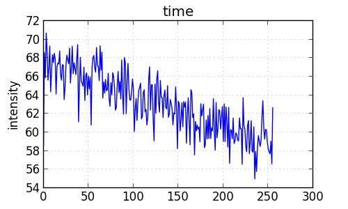

minimal code to turn linescans of spines into intensity measurements

## Path:

## Red and Green Intensity vs Time:
 

## Red Inteisity vs Poisition:

## Red and Green Inteisity vs Time (narrow selection):

