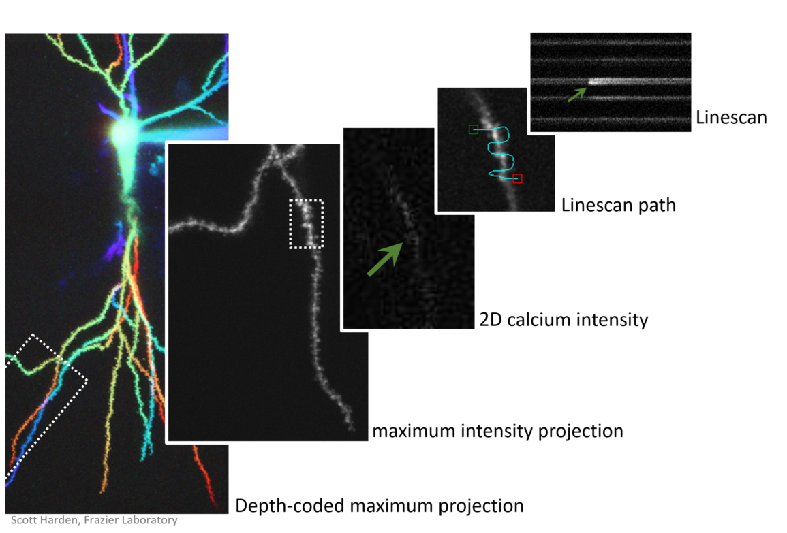
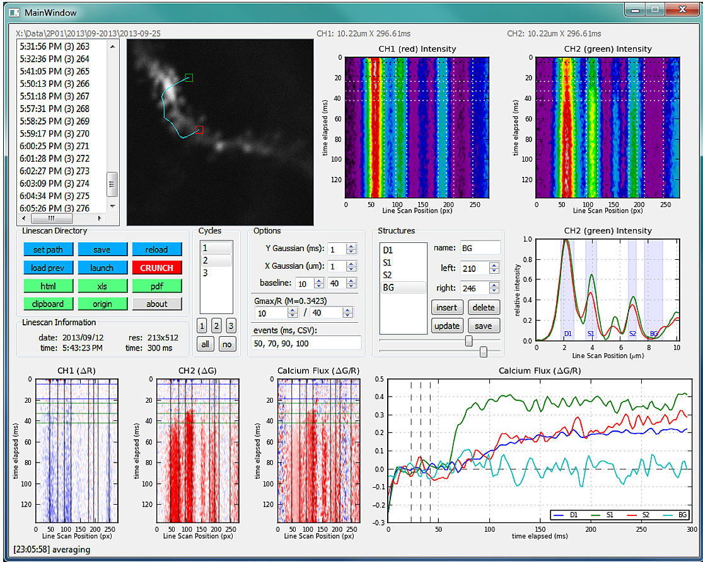
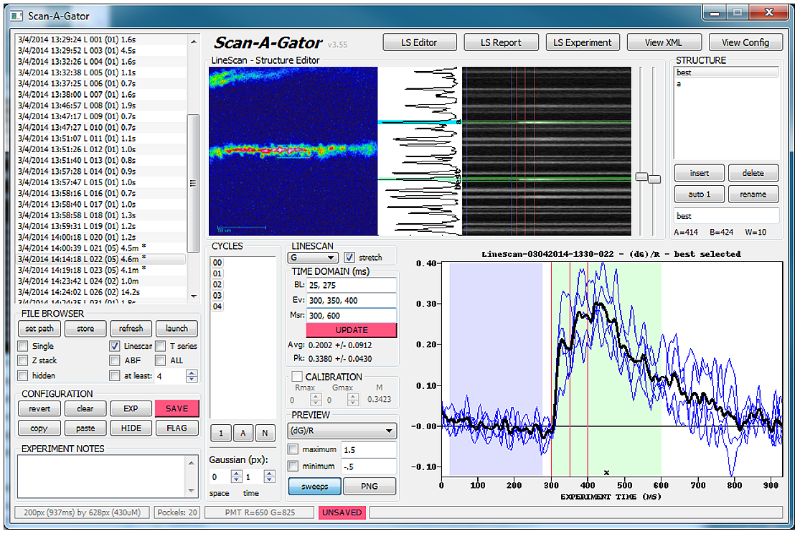
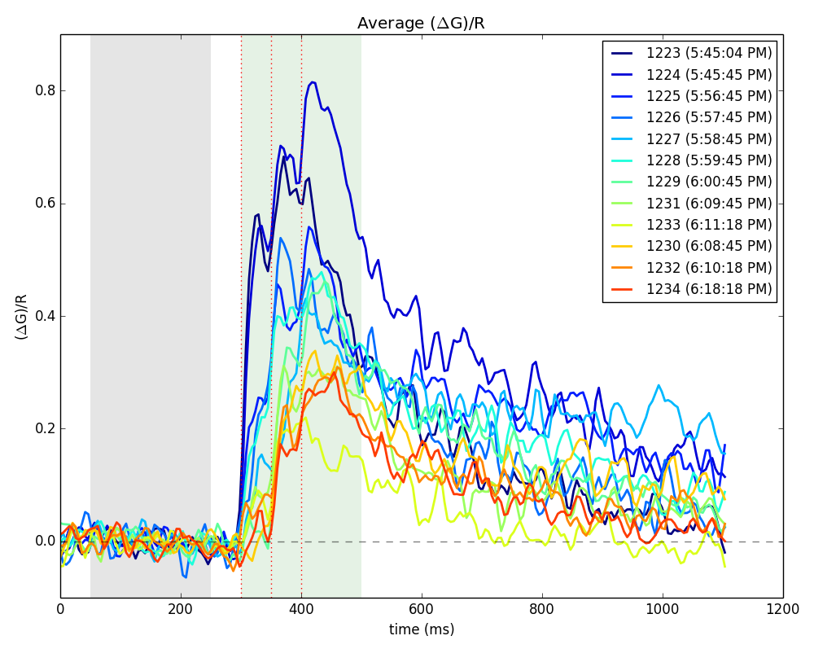
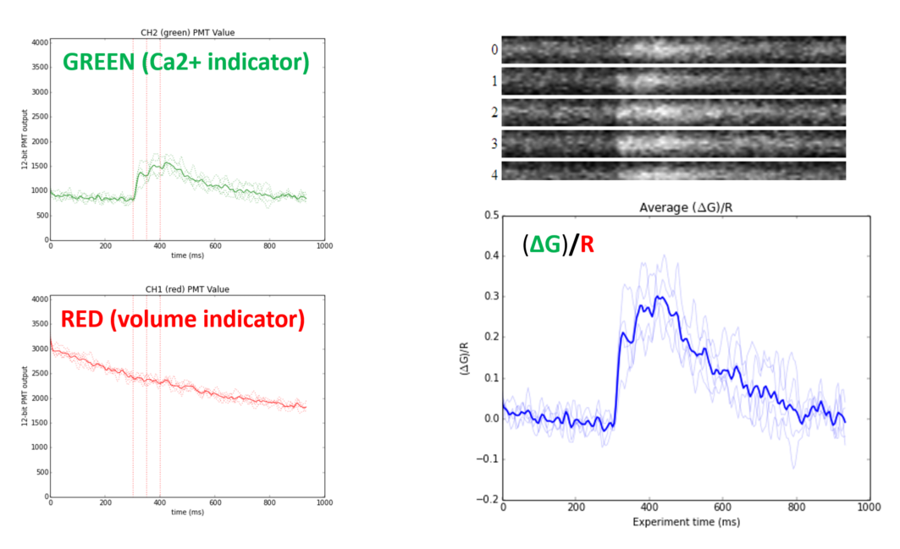
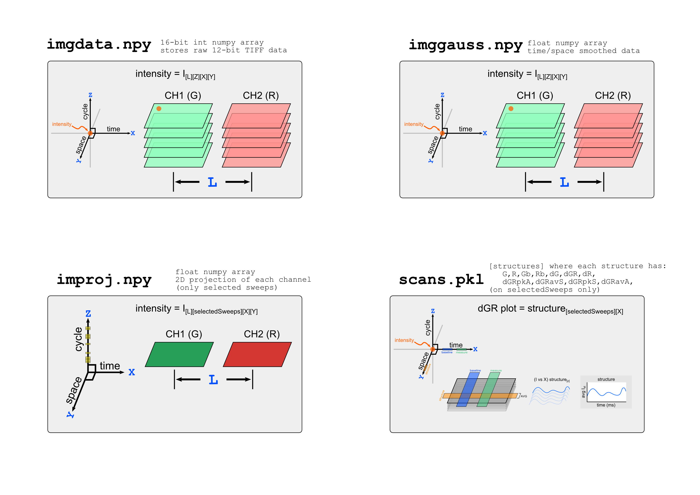

Software here relates to analysis of calcium transients in linescans (likely spines of dendrites)

## Experiment Design

## Scan-A-Gator
Different versions of scan-a-gator software for linescan analysis of calcium transients. This coded is provided for search / reference only and is ***extremely broken*** and unusable on modern versions of python. Although it probably technically works on Python(X,Y) for Python 2.x, it was not designed for forward compatability.

### Version 1

### Version 2 (supports multi-structure measurements)

### Sample Output

### Math Concept

## Data Output Convention for Linescan Analysis

