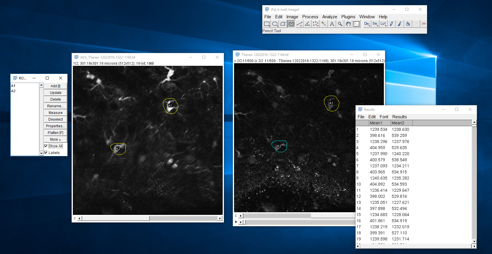
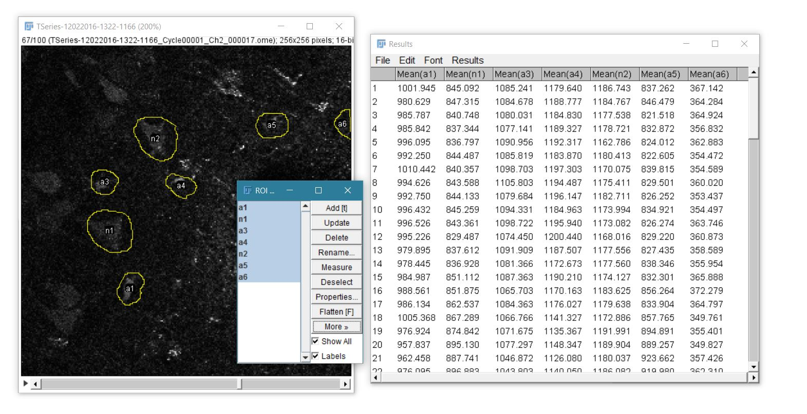
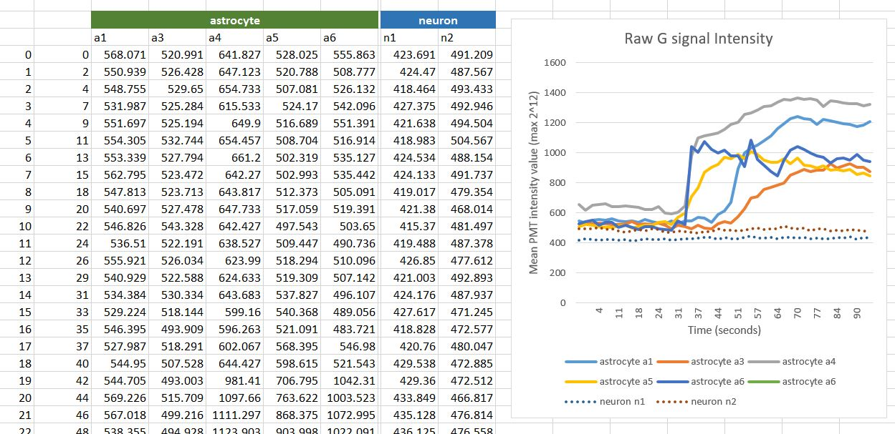
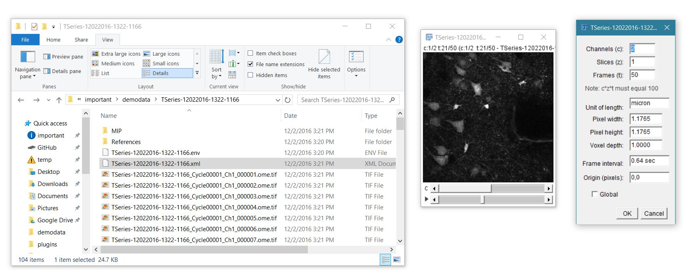

### NOTE: SWH2P is now its own project: https://github.com/swharden/SWH2P

---

# Time-series Analysis with ImageJ and Excel
This guide will walk you through how to analyze a T-series fresh off the two-photon microscope using a stock [FIJI](https://fiji.sc/) (not raw ImageJ) and Excel. No custom software is required.

## Steps
* load all images by dragging/dropping the XML file (in the T-Series folder) onto ImageJ
  * ensure ALL checkboxes are unchecked
  * the stack viewing mode should be _Hyperstack_
  * the color mode should be _Grayscale_
  * to make loading, you can save the image as a single TIF and reload that TIF in the future
  * the image will have two scroll bars at the bottom. The upper one is for _channel_ and the lower one is for _time_.
* Create a maximum projection (of either channel) to make drawing of ROIs easy. **Image > Stack > Z project** and select _Average_ (not maximum projection!)
  * do all ROI creation on the projection. You can later use these same ROIs on the original data.
* click **analyze > tools > ROI manager** _(ROI means "region of interest")_
* use the "freehand sections" tool (as opposed to the square or circle) to outline some cells. 
  * Every time you outline a cell, click the **add** button on the ROI manager.
  * I recommend naming cells as you add them (click the **rename** button).
  * Be sure to indicate whether the thing is a neuron or astrocyte.
* when all cells have been outlined, highlight them all (with shift-click or control-click) and save the ROIs by clicking **more > save**.
  * once ROIs have been saved, you can load the same ROIs on the red stack, green stack, or a projection image
* deterime what data to analze by clicking **analyze > set measurements**
  * I recommend selecting ONLY "Mean gray value"
* analyze the data in the ROI manager by clicking **more > multi measure**
* in the results window, click **file > save as** and call it something
  * Excel 2016 may not be able to open the .xls file. You may have to rename it to .tsv (short for tab-separated values) and drag/drop it into a blank excel worksheet.
* Once the data is in excel, you will need to add a "time" column
  * the easiest way to know the frame rate is to note it in your lab notebook at the time of scanning
  * In the folder with the TIFs, the .env file will have a line `<PVStateValue key="framerate" value="1.55886096807798"` which shows the framerate. Similarly, the .xml file has a lines starting with `<Frame relativeTime="1.92448208110496"` for every image taken which show the time each image was taken. You can use these to determine the frame rate in case you forgot previously.

# Analyzing Data
* Generate excel data for the red channel and the green channel.
* baseline subtract the entire green channel values by the average of the green channel before the stimulus. DO NOT BASELINE SUBTRACT THE RED CHANNEL!
* Assuming in excel you have a [red] column and a [baseline subtracted green] column, create a new column [dG/R] which is simply the second column divided by the first. This is the value you will want to report in a publication.

## Selecting ROIs
multi-measure was performed and all ROIs were selected. This screenshot was taking just before the ROIs were saved.

## Handling Data in Excel
I separated by ROIs by neuron vs. astrocyte. I goofed on the time units though, which according to the XML document should be <1 second and not 2.2 seconds. Also note that this is just the green channel, and not the red channel, baseline-subtracted green channel, or dG/R calculated values.

## misc

