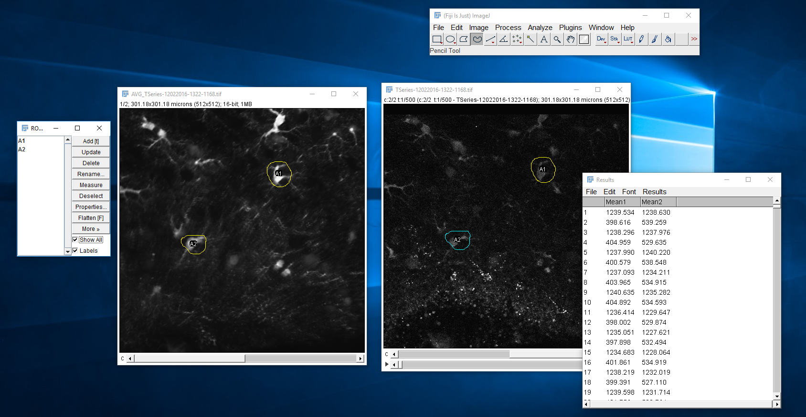

### ImageJ / Excel Solution

Scott [wrote a guide](2016-12-02-excel/readme.md) for how to do this

### Pure Python Solution (OLD)

I think our best effeciency / data ratio will come from drawing ROIs from average projections in FIJI (naming and saving those ROIs as .zip files), then having Python read the ROIs and analyze them how we desire. I've gone ahead and written a simple python script to take in a TSeries directory and output dF/F readings. Manually defining ROIs is required. Currently it doesn't read from ImageJ ROI Zips (but there are pypi modules to do this), it just takes X,Y coordinates to draw a square around the neuron or astrocyte of interest.

Structure | Data
--- | ---
 | 
 | 
